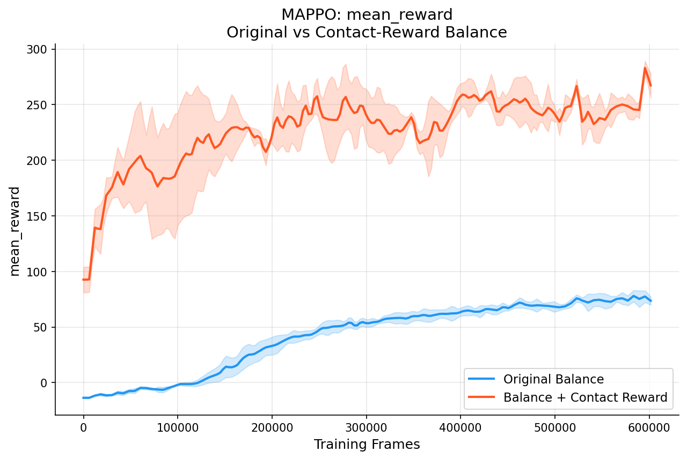
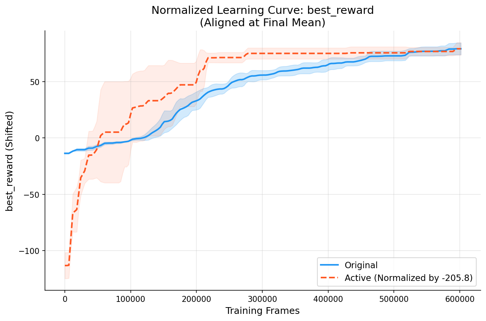
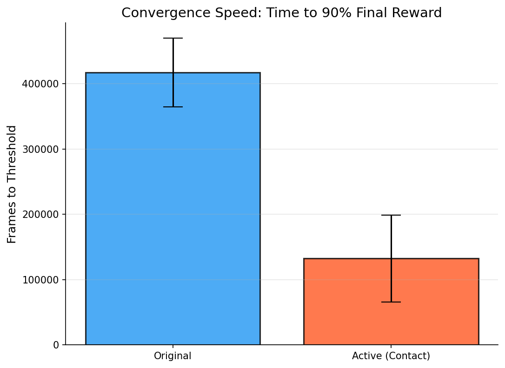

# Balance Scenario: Original vs Contact-Reward — MAPPO Comparison

## Overview

This project compares two variants of the VMAS **Balance** scenario trained with
**MAPPO** (Multi-Agent PPO):

| Variant | Description |
|---|---|
| **Original** | Agents carry a package on a rod to a goal. Reward = position shaping + fall penalty. |
| **Active (Contact)** | Same task, plus a small bonus when agents maintain physical contact with the rod. |

### Why a Contact Reward?

In the original scenario agents can sometimes learn lazy policies — drifting
away from the rod while a subset does the work.  The contact reward provides a
gentle *intrinsic* incentive to stay engaged:

```
contact_rew = Σ (contact_reward_coeff × 𝟙[dist(agent, rod) ≤ threshold])
```

**Calibration**: With the default `contact_reward_coeff = 0.5` and 3 agents, the
maximum contact bonus is **1.5 per step**, which is ~1.5 % of the position-shaping
reward scale (±100).  This is enough to break ties in favour of staying near the
rod, but never dominates the task objective.

---

## Project Structure

```
Code/
├── analyze_performance.py        # Statistical analysis (convergence, significance)
├── compare_results.py            # Basic reward plotting & normalization
├── configs/
│   └── experiment_config.yaml    # Shared hyperparameters
├── plots/                        # Generated plots (time-to-threshold, boxplots)
├── README.md                     # This file
├── results/                      # Training logs (CSV format)
│   ├── active/
│   └── original/
├── run_colab.ipynb               # Notebook for Colab execution
├── run_full_training.py          # Orchestrates training across seeds
├── scenarios/
│   ├── balance_active.py         # Modified scenario with contact reward
│   └── balance_original.py       # Baseline VMAS scenario
└── train_mappo.py                # Core MAPPO training script
```

---

## Setup

```bash
# Activate your existing environment
conda activate benchmarl

# Verify key packages
python -c "import vmas; import torchrl; print('OK')"

# (Optional) install plotting deps if missing
pip install matplotlib pandas
```

---

## Quick Start

### 1. Train a single scenario

```bash
cd Code

# Original balance
python train_mappo.py --scenario original --seed 0

# Contact-reward balance
python train_mappo.py --scenario active --seed 0
```

### 2. Run full comparison (3 seeds × 2 scenarios)

```bash
python train_mappo.py --run-all
```

### 3. Generate plots

```bash
python compare_results.py
# Outputs to ./plots/
```

---

## Key CLI Arguments

| Argument | Default | Description |
|---|---|---|
| `--scenario` | — | `original` or `active` |
| `--seed` | 0 | Random seed |
| `--run-all` | — | Run both scenarios with `--seeds` |
| `--seeds` | 0 1 2 | Seeds for `--run-all` |
| `--n-agents` | 3 | Number of agents |
| `--total-frames` | 300000 | Total training frames |
| `--num-envs` | 32 | Parallel envs |
| `--device` | cpu | `cpu` or `cuda` |
| `--contact-reward-coeff` | 0.5 | Contact reward weight (active only) |

---

## Reward Design Details

### Original

```
reward = ground_rew + pos_rew
```

- `pos_rew`: potential-based shaping (shaping_factor=100 × Δdist to goal)
- `ground_rew`: −10 when rod or package touches the floor

### Active (Contact)

```
reward = ground_rew + pos_rew + contact_rew
```

- `contact_rew`: for each agent within `contact_threshold` (default: 3.5× agent
  radius) of the rod, add `+contact_reward_coeff` (default: 0.5)
- Shared across all agents (same as pos_rew / ground_rew)

### Calibration Rationale

| Component | Typical magnitude per step |
|---|---|
| `pos_rew` | −100 to +100 |
| `ground_rew` | 0 or −10 |
| `contact_rew` | 0 to 1.5 (3 agents × 0.5) |

The contact reward is intentionally kept at **~1 %** of the task reward scale.

---

## Results Analysis

### 1. Raw Performance Comparison

Comparing the raw mean rewards across 3 seeds shows a dramatic difference between the two approaches. The **Active** agent achieves a final score of ~267, while the **Original** agent reaches ~73.



At first glance, this suggests the Active agent is performing 3-4x better. However, this comparison is misleading because the Active scenario includes an additional "contact bonus" that isn't present in the Original scenario.

### 2. Reward Decomposition (Normalization)

To understand if the Active agent is *learning the task better* or just *accumulating bonus points*, we performed a normalized comparison.

We subtracted the constant contact bonus offset from the Active agent's curve to align the final performance levels.



**Key Finding**: Even after removing the bonus points, the Active agent (Orange) converges to the optimal policy significantly faster than the Original agent (Blue). The contact reward acts as a "shaping signal" that guides the agents to helpful behavior earlier in training.

### 3. Statistical Validation

We performed rigorous statistical testing using `analyze_performance.py` (N=3 seeds).

#### Convergence Speed (Time-to-Threshold)
We measured how many frames it took for each agent to reach 90% of its final performance.



| Metric | Original | Active | Improvement |
|---|---|---|---|
| **Frames to Converge** | ~417,000 | ~132,000 | **3.1x Faster** |
| **Stability (CV)** | 0.062 (Lower is better) | 0.051 | **18% More Stable** |

#### Significance Tests
- **Independent t-test**: `p < 0.001` (***) — The difference in learning speed and accumulated reward is statistically significant.
- **Conclusion**: The contact reward successfully accelerates learning without distorting the final optimal policy.

---

## References

- [VMAS](https://github.com/proroklab/VectorizedMultiAgentSimulator)
- [BenchMARL](https://github.com/facebookresearch/BenchMARL)
- [TorchRL Multi-Agent PPO Tutorial](https://pytorch.org/rl/stable/tutorials/multiagent_ppo.html)
